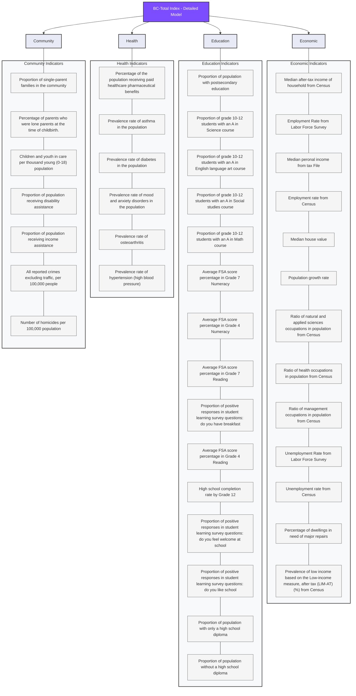
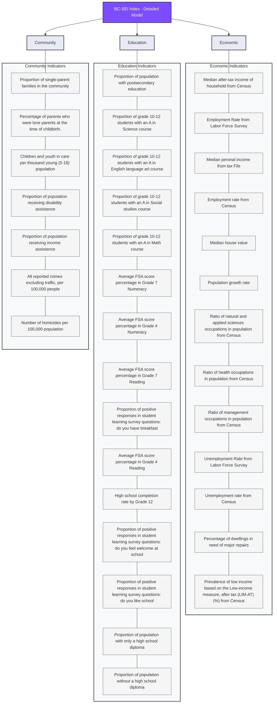
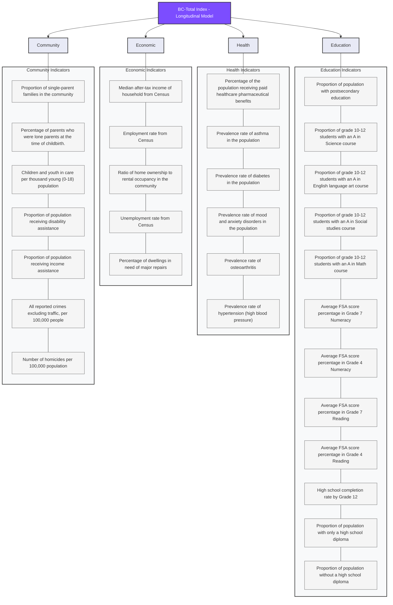
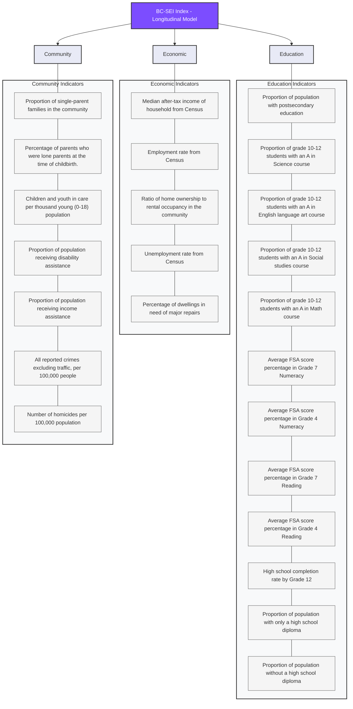

# British Columbia Socio-Economic Index (BC-SEI)

## Table of Contents

-   [Introduction](#introduction)
-   [Methodology](#methodology)
-   [Index Construction](#index-construction)
-   [Variables](#variables)
-   [Geographic Areas](#geographic-areas)
-   [Interpretation](#interpretation)
-   [Limitations](#limitations)
-   [Use Cases](#use-cases)
-   [References](#references)

## Introduction

The British Columbia Socio-Economic Index (BC-SEI) is a measure of socio-economic advantage and disadvantage across different geographic areas in British Columbia. Following a similar approach to the Australian Bureau of Statistics' Socio-Economic Indexes for Areas (SEIFA), this index summarizes various social and economic conditions of people and households within defined areas.

The BC-SEI provides a method for determining the level of social and economic wellbeing in each area by incorporating multiple dimensions including income, education, employment, housing, and other factors that influence socio-economic conditions.

## Methodology

The BC-SEI are constructed using principal components analysis (PCA), a statistical technique that summarizes the information from a set of correlated variables into a smaller number of components. The first principal component, which explains the largest proportion of the total variation in the data, forms the basis of the index.

Data sources include: 
- Census data 
- Tax data 
- Administrative data from provincial and federal agencies

## Index Construction

The index is constructed through the following steps:

1.  Selection of variables based on their relevance to socio-economic advantage and disadvantage
2.  Standardization of variables (converting to z-scores)
  2.1 impute missing values using KNN
3.  Application of principal components analysis in base year. 
  3.1 removal of co-linear and low impact variables
4.  Extraction of the first principal component as the primary index
5.  Transformation of index scores to a scale with a mean of 1000 and standard deviation of 100
6. Apply model to other years data.

## Variables

The BC-SEI incorporates variables across four main domains, with the following hierarchical structure:

### Updated model

The updated model is only available for 2023 due to many variables are only available for 2023.

The BC-Total Index has been created using four sub-indices: ECON, EDUC, HEALTH, and COMMUNITY. 

The BC-SEI Index has been created using three sub-indices: ECON, EDUC, and COMMUNITY. 

### Longitudinal model

The longitudinal model is the version 1 of the BC-SEI index which has been created using data from 2003 to 2023. 

A few variables are available for creating the BC-Total index.

## Geographic Areas 

The BC-SEI is calculated for various geographic levels:

-   Community Health Service Delivery Areas
-   Census Subdivisions (municipalities)
-   Dissemination Areas (small areas composed of one or more neighboring blocks)

## Interpretation 

The BC-SEI is designed so that higher scores indicate relative advantage, while lower scores indicate relative disadvantage. The scores are relative within British Columbia, with:

-   A score of 50 representing the provincial average
-   Scores above 50 indicating relative advantage
-   Scores below 50 indicating relative disadvantage

The index represents a continuum from most disadvantaged to most advantaged rather than specific categories or thresholds of disadvantage.

## Limitations 

Key limitations of the BC-SEI include:

-   The index measures relative, not absolute, disadvantage
-   Area-based measures may not reflect the diversity within areas
-   The index represents an average for an area and doesn't identify pockets of advantage or disadvantage
-   Rural and remote areas may have different patterns of advantage/disadvantage that are not well-captured
-   The index should be used alongside other measures for comprehensive analysis

## Use Cases 

The BC-SEI can be used for:

-   Identifying areas of relative socio-economic disadvantage for resource allocation
-   Planning service delivery and community development initiatives
-   Research on health, education, and social outcomes
-   Policy development and evaluation
-   Comparative analysis across different geographic areas

## References 

-   Statistics Canada (2021). Census of Population.
-   BC Stats (2023). British Columbia Socio-Economic Index Technical Documentation.
-   Australian Bureau of Statistics (2018). Socio-Economic Indexes for Areas (SEIFA).
